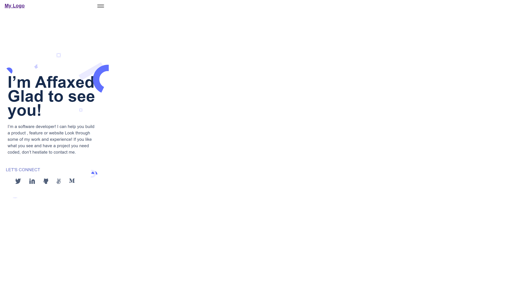
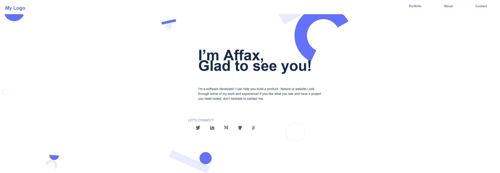

Portfolio

This is the second Microverse Project  for the week. It involves creating a simple none responsive portfolio usiing figma tempalates , HTML and CSS

## Built With

HTML
CSS

## Live Demo

[Live Demo Link](https://delhinrharl.github.io/Portfolio/
)

## Getting Started

To get a local copy up and running follow these simple example steps.

### Prerequisites
HTML,CSS,Git basics
### Setup
Find Template at https://www.figma.com/file/l7SqJ3ZfkAKih9sFxvWSR4/Microverse-Student-Project-1?node-id=39%3A546. 
use this template to work on the project
### Install
Visual Studio Code Editor
Web Browser
Make a clone of the Repository using git@github.com:DelhinRharl/Portfolio.git
### Run tests
create a workflow folder in the repository folder 
and run .github/workflows/linters.yml

## Authors

👤 **Author1**

- GitHub: [@DelhinRharl](https://github.com/DelhinRharl)
- Twitter: [@tdelhinrharl](https://twitter.com/delhinrharl)
- LinkedIn: [LinkedIn](https://linkedin.com/in/AffaxedKiprotich)

## 📝 License

This project is [MIT](./MIT.md) licensed.
